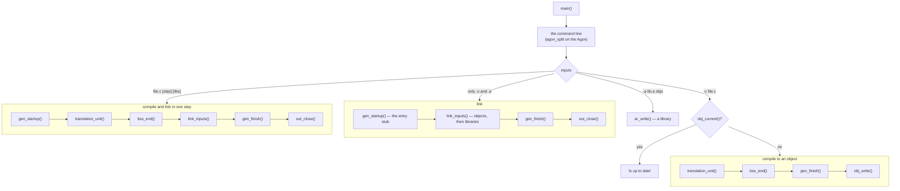
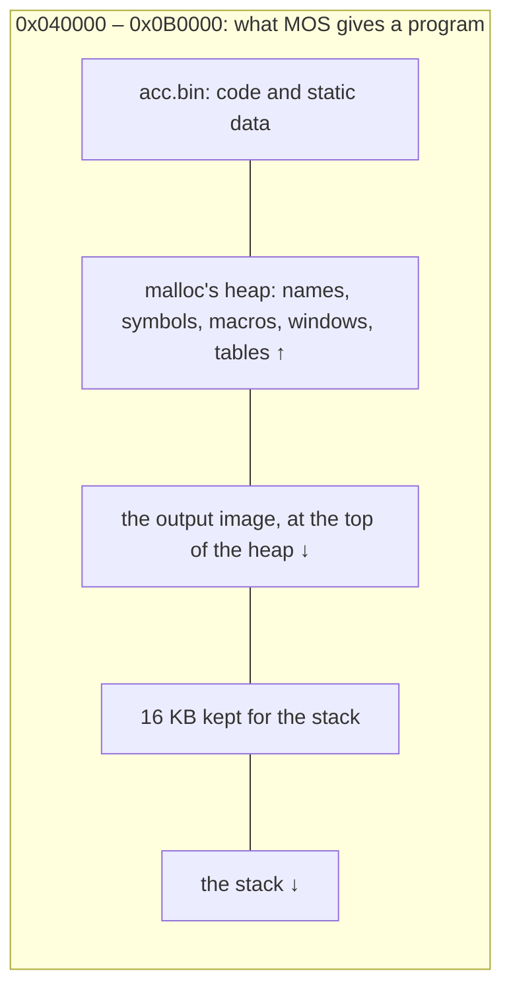
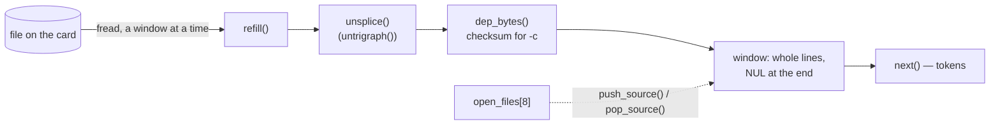
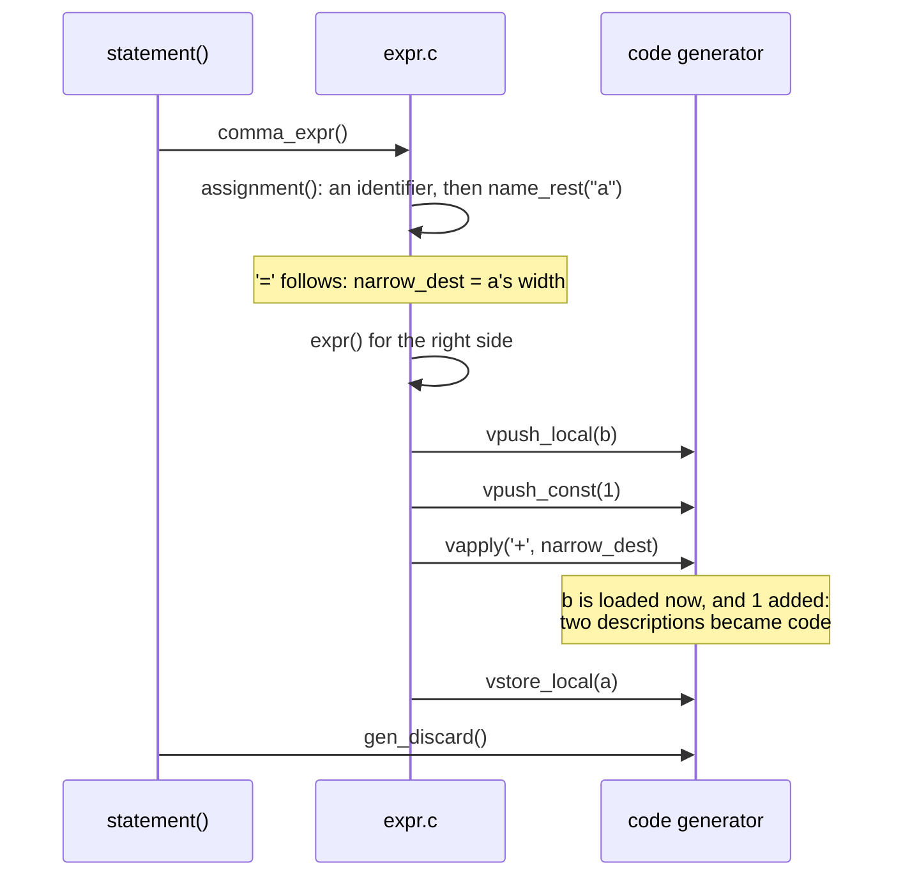
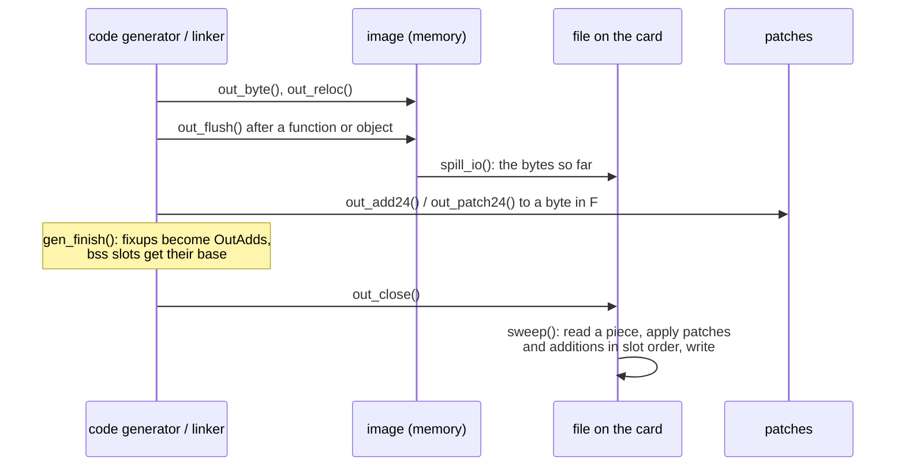
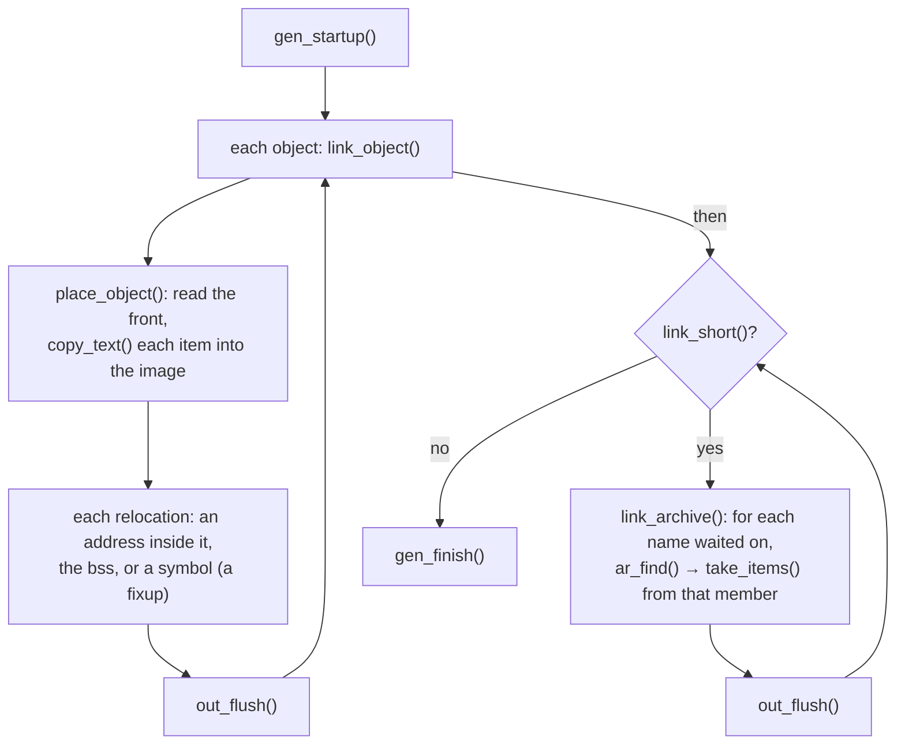

# How acc works

acc is a C99 compiler, with its own linker and librarian, for the Agon
Light's eZ80. It runs on the Agon itself, in the 448 KB MOS gives a
program, and on a host, where it is developed. It compiles in one pass:
there is no syntax tree and no intermediate form, and the parser calls the
code generator as it recognises each construct. Most of the design follows
from those two facts -- the machine is small and slow, and nothing is
built that the next step does not need. This document walks through the
parts and how they fit together. What the code generator does to make
good code is in [OPTIMIZATIONS.md](OPTIMIZATIONS.md).

The compiler is 31 C files in six parts, each with a header for what the
rest of acc needs from it and an internal header its own files share:

| part | files | header | internal | sections |
|---|---|---|---|---|
| front end | [`names.c`](../src/names.c) [`source.c`](../src/source.c) [`macro.c`](../src/macro.c) [`directive.c`](../src/directive.c) [`lex.c`](../src/lex.c) [`float.c`](../src/float.c) | [`names.h`](../src/names.h) [`lex.h`](../src/lex.h) | [`lex_int.h`](../src/lex_int.h) | 3–6 |
| symbols | [`sym.c`](../src/sym.c) | [`sym.h`](../src/sym.h) [`types.h`](../src/types.h) | | 7 |
| parser | [`decl.c`](../src/decl.c) [`type.c`](../src/type.c) [`init.c`](../src/init.c) [`stmt.c`](../src/stmt.c) [`expr.c`](../src/expr.c) [`inline.c`](../src/inline.c) | | [`parse_int.h`](../src/parse_int.h) | 8 |
| code generator | [`vstack.c`](../src/vstack.c) [`insn.c`](../src/insn.c) [`arith.c`](../src/arith.c) [`wide.c`](../src/wide.c) [`lvalue.c`](../src/lvalue.c) [`branch.c`](../src/branch.c) [`func.c`](../src/func.c) [`runtime.c`](../src/runtime.c) [`relax.c`](../src/relax.c) [`finish.c`](../src/finish.c) | [`gen.h`](../src/gen.h) | [`gen_int.h`](../src/gen_int.h) | 9–13 |
| output and link | [`image.c`](../src/image.c) [`reloc.c`](../src/reloc.c) [`obj.c`](../src/obj.c) [`archive.c`](../src/archive.c) [`link.c`](../src/link.c) | [`out.h`](../src/out.h) [`obj.h`](../src/obj.h) | [`out_int.h`](../src/out_int.h) [`obj_int.h`](../src/obj_int.h) | 14–16 |
| driver | [`main.c`](../src/main.c) [`diag.c`](../src/diag.c) [`fmt.c`](../src/fmt.c) | [`diag.h`](../src/diag.h) [`fmt.h`](../src/fmt.h) | | 2, 17 |

[`acc.h`](../src/acc.h) includes the public headers, and is what a file outside a part
includes. The runtime the generated code calls is eZ80 assembly in
[`lib/rt/`](../lib/rt), assembled by zap into a library of its own,
`rt.a`, beside the C library (section 12).
The C library acc links programs against is in [`lib/`](../lib) and
[`include/`](../include), and its C is compiled by acc itself. The
program's entry stubs are in [`src/rt/startup.s`](../src/rt/startup.s),
assembled on the host and carried in acc as bytes.

Code links in this document point at definitions.

---

## 1. Constraints

Everything below is shaped by four facts about the machine:

- **448 KB for everything.** acc's own image, its heap and its stack share
  the RAM MOS gives a program. acc.bin is itself about 240 KB of that, so a
  compile has roughly 200 KB for the source windows, the name and symbol
  tables, and the output. What does not fit is spilled to the SD card.
- **An 18.432 MHz eZ80 with no cache.** Every instruction costs its bytes
  in memory cycles. A multiply, a shift by a variable, a signed compare,
  any 24-bit AND, OR or XOR, and scaling an index by anything but 1 are
  calls into agondev's runtime when acc is built by agondev, so the code
  of acc avoids them (section 18).
- **The SD card is slow and MOS's file calls are dear.** Each read or
  write goes through the whole of MOS's file layer, so acc reads and
  writes in pieces of kilobytes, and keeps few files open, since MOS gives
  a program few handles.
- **No clock that persists and no loader.** MOS loads a program at
  `0x040000` and jumps into it; there is no relocation and there are no
  sections. What acc writes is exactly what runs.

## 2. The shape of a run

A run does one of four things, chosen by what is on the command line:



[`main()`](../src/main.c#L358) ·
[`agon_split()`](../src/main.c#L297) ·
[`ar_write()`](../src/archive.c#L116) ·
[`obj_current()`](../src/obj.c#L963) ·
[`translation_unit()`](../src/decl.c#L1090) ·
[`bss_end()`](../src/decl.c#L872) ·
[`gen_finish()`](../src/finish.c#L760) ·
[`obj_write()`](../src/obj.c#L434) ·
[`gen_startup()`](../src/finish.c#L1055) ·
[`link_inputs()`](../src/link.c#L567) ·
[`out_close()`](../src/image.c#L821)

The one-step build is a compile whose image is then linked in place: the
program's own code is laid down first, after the entry stub, and the
objects and libraries it names -- and then the default library,
`/lib/acc/rt.a` and `/lib/acc/libc.a` on the Agon -- are placed after it, exactly as a link of
its object would place them.

A compile to an object is based at address 0, so that every address in it
is an offset from its own first byte and placing it is one addition. A
program is based at `0x040000`, or wherever `-b` says.

Every error is fatal. [`acc_error()`](../src/diag.c#L126) prints it in gcc's form,
`file:line:col: error: message`, abandons the output so that no
half-written file is left behind, and exits (section 17).

## 3. Memory on the Agon



agondev's realloc never grows a block in place: it mallocs the new one,
copies, and frees the old, so a table that doubles holds three times its
size at the moment it grows. acc is written around that:

- **The output image lives at the top of the heap**, out of malloc's way,
  and grows downwards by moving its own bytes within what is then its own
  ([`img_grow()`](../src/image.c#L198)). malloc's break is kept below it by acc's own
  sbrk, [`_wrap__sbrk()`](../src/image.c#L171), which the Agon build links in place of
  libagon's.
- **Arenas grow in chunks that never move.** Names
  ([`names_chunk()`](../src/names.c#L206)), struct members ([`members_chunk()`](../src/sym.c#L652)) and
  macro records ([`macro_new()`](../src/macro.c#L76)) each take a new chunk when the last
  is full, so no pointer into them goes stale and nothing is copied.
- **Tables that would be long are kept in blocks.** The fixups
  (`FIXUP_BLOCK`, 256 entries of 6 bytes) and the patches to the output
  file (`PATCH_BLOCK`) are linked blocks rather than one array.
- **The heap stops 16 KB short of the stack.** agondev's linker script puts
  the top of the heap and the bottom of the stack at the same address; acc's
  own, [`src/agon.ld`](../src/agon.ld), leaves `ACC_STACK_RESERVE` between
  them, so a compile that runs out of memory gets a null from malloc and
  says so, rather than writing over its own frames. 127 nested blocks,
  C99's own limit, use under 13 KB of it.
- **What a function needs only while it is compiled is given back** at its
  end ([`gen_forget()`](../src/func.c#L777)), and the output image is written to the card
  a function at a time (section 14).

On the host the same code runs with malloc and realloc, and the name arena
and member chunks come from one large reservation.

## 4. Names

Every identifier and every macro name is interned once, in
[`name_intern()`](../src/names.c#L290), into an arena of NUL-terminated strings, and is
referred to from then on by its offset: a `NameRef`, three bytes on the
Agon. Nothing is ever freed.

Four bytes in front of each name's text carry what is looked up most often,
so that finding it costs one load rather than a table probe:

| byte | holds | read by |
|---|---|---|
| `ref-4` | `NAME_MACRO`, `NAME_WIDE`, `NAME_WEAK`, `NAME_STRONG` | [`name_is_macro`](../src/lex_int.h#L103), [`name_weak()`](../src/names.c#L349) |
| `ref-3 .. ref-1` | the file-scope symbol for this name, plus one — or, for a keyword, its token code at `ref-3` | [`name_global()`](../src/sym.c#L110), [`next()`](../src/lex.c#L1028) |

The hash table uses open addressing with linear probing over 4-byte slots,
kept at most three quarters full. The hash, [`name_home()`](../src/names.c#L124), is two
lanes over a Pearson permutation, `pearson[]`, so it needs no multiply and
no 24-bit XOR -- both of which are runtime calls here -- and it probes
about 1.5 times a lookup. The slot's offset is built a byte at a time,
which caps the table at 64 KB: 16,384 slots and 8,191 names. A lookup
compares with `strncmp` and a terminator test rather than `memcmp`, which
could read past the arena's end.

## 5. Reading source

Each file is read through a window rather than loaded whole, since several
are open at once: 4 KB for the file named on the command line and 2 KB for
each header. [`refill()`](../src/source.c#L817) keeps one invariant: **the window always
holds whole lines**. It moves the unread tail to the front, reads to fill
the window, then trims back to the last newline; a line longer than the
window doubles it, up to 64 KB ([`window_grow()`](../src/source.c#L799)). A NUL is written
after the last byte, so the scanners stop there without a bounds test.

Because a line is never split, tokens point straight into the window, a
`*/` is never cut in two, and a column is found only when an error needs
one, by walking back from the token to its line's start
([`column_of()`](../src/source.c#L1175)).

Line splices and universal character names are dealt with once per window,
in [`unsplice()`](../src/source.c#L509), before any scanner sees the text: a backslash-
newline is removed and its newline put back at the end of the logical line,
so line numbers stay right, and `\uXXXX` is rewritten as UTF-8 in place.
Trigraphs are replaced only with `-trigraphs` ([`untrigraph()`](../src/source.c#L483)).



[`refill()`](../src/source.c#L817) ·
[`unsplice()`](../src/source.c#L509) ·
[`dep_bytes()`](../src/source.c#L217) ·
[`next()`](../src/lex.c#L1028) ·
[`push_source()`](../src/source.c#L889) ·
[`pop_source()`](../src/source.c#L1007)

Files, and macro expansions, are a stack of `Source` levels, eight deep.
[`push_source()`](../src/source.c#L889) saves the current window's state, notes the file
offset, and **closes the file**; [`pop_source()`](../src/source.c#L1007) reopens it and
seeks back. So however deep the includes go, one file is open at a time.
[`push_text()`](../src/source.c#L961) pushes a window over text already in memory, which
is how a macro expansion is read (section 6).

A window can also be recorded and replayed. [`lex_record_from()`](../src/source.c#L604)
starts copying the raw text of what is read into a buffer, and
[`lex_push_record()`](../src/source.c#L775) reads it back as a new level. The parser uses
this for three things that must be read twice: a `for` loop's step, which
is compiled after the body (section 8); the return expression of a
`static inline` function, which is expanded at each call; and the size of
a variable-length array parameter, which C99 evaluates on entry to the
function.

### The up-to-date check

An object records every file it was compiled from, with a checksum of its
bytes -- the Agon has no clock that persists, so there are no timestamps.
A header from the build's own include directory is recorded by its name
there, `<stdio.h>`, and found again through whichever directory the acc
checking has ([`dep_name()`](../src/source.c#L330)), so an object is the same file made on
the host or the Agon.
[`marks_fold()`](../src/source.c#L185) keeps two 24-bit sums, `sum += byte; weighted +=
sum`, as [`refill()`](../src/source.c#L817) reads each window, so nothing is read twice.
On the Agon it is eight instructions of hand-written assembly,
[`src/marks.s`](../src/marks.s). `-D`, `-U` and `-I` are folded into a
pseudo-file of their own. `acc -c` then answers "up to date" without
compiling when [`obj_current()`](../src/obj.c#L963) finds the object was made by this
build of acc and every file it names still has the same size and sums.

## 6. The preprocessor

The preprocessor is not a separate pass: [`next()`](../src/lex.c#L1028) runs it as it
goes.

**Macros.** A name with the `NAME_MACRO` flag is looked up in a hash table
of pointers to 16-byte `Macro` records ([`macro_slot()`](../src/macro.c#L105)); the
records live in chunks and do not move. A macro's text is kept as written,
and expanding it ([`expand()`](../src/macro.c#L673)) pushes that text as a new source
window. Rescanning, and macros inside macros, fall out of the machinery
`#include` already needs. A function-like macro's arguments are collected
by [`collect_args()`](../src/macro.c#L314), substituted by
[`build_expansion()`](../src/macro.c#L500) -- `#` stringizes, `##` pastes, and ordinary
arguments are expanded first -- and the result is pushed as a window that
frees its text when it is popped. [`expanding()`](../src/macro.c#L234) stops a macro
expanding inside itself by checking the levels on the source stack.
`__FILE__`, `__LINE__`, `__DATE__`, `__TIME__` and the `__STDC__` family
are keywords resolved by [`predefined()`](../src/macro.c#L637); `__DATE__` and `__TIME__`
are acc's own build time, so output is reproducible.

**Directives.** [`directive()`](../src/directive.c#L1608) dispatches on the name.
[`logical_line()`](../src/directive.c#L86) copies a directive's logical line into a
buffer of its own, joining splices and replacing comments with a space,
since a refill would move the text under it. `#include` searches the
including file's directory for `"..."`, then each `-I` in order, then
`/lib/acc/include` on the Agon ([`find_include()`](../src/directive.c#L259)).
`#pragma once` is kept by the path a header resolved to;
`#pragma weak` marks a name weak; other pragmas are ignored.

**`#if`.** [`if_condition()`](../src/directive.c#L1131) expands the line into text, then
evaluates it in `long long` with one function per precedence level, from
[`if_ternary()`](../src/directive.c#L1068) down to [`if_primary()`](../src/directive.c#L765). A division
by zero in a branch that is not taken is not an error.

**Skipped groups** are read as lines, not tokens
([`skip_group()`](../src/directive.c#L1168)): only conditional directives and block
comments are looked at.

## 7. Tokens and symbols

[`next()`](../src/lex.c#L1028) leaves the current token in globals the parser reads
directly: `tok`, `tok_name`, `tok_val`, and the string in `str_buf`.
`accept` and `expect` are macros in [`lex.h`](../src/lex.h), so the common case is a
compare and no call.

- **Keywords** are interned first, so they are exactly the names below
  `kw_limit`, and each keeps its token code at byte `ref-3` of its name.
  Recognising one is a compare and a load, however many keywords there are.
- **Punctuators** go through a 256-entry table, `punct[]`.
- **Numbers** are read by [`lex_number()`](../src/lex.c#L301), typed by C99's ladder of
  int, long and long long; a floating literal is converted by
  [`float_literal()`](../src/float.c#L392), acc's own correctly-rounded conversion, so the
  host and the Agon agree.
- **Wide literals** are UTF-16, with surrogate pairs.

Each of these is out of line so that `next()` itself needs no stack frame.

**Symbols.** A `Sym` is 15 bytes: name, kind, value, type, extension,
qualifiers, first parameter, count and flags ([`sym.h`](../src/sym.h)). They are kept in
one array, [`sym_table`](../src/sym.c#L53), with file-scope symbols at the bottom and
the current function's locals above them, and a symbol is known by its
**byte offset** into the array, so finding one is an addition with no
multiply. [`sym_find()`](../src/sym.c#L247) walks the locals back from the top, then
reads the file-scope symbol straight out of the name's `ref-3` bytes. A
new file-scope symbol is inserted below the locals
([`sym_push()`](../src/sym.c#L203)), so file-scope offsets never change. Struct tags live
in the same table under a name no identifier can begin with.

**Types.** A `Type` is one byte ([`types.h`](../src/types.h)): three bits of width, an
unsigned bit, a floating bit, and three bits of pointer depth. An array,
function, struct, union, VLA or bit-field type is `TY_EXT` or
`TY_STRUCT`/`TY_FUNC` plus an **extension byte** that indexes a table of
255 entries, interned by shape: [`ext_array()`](../src/sym.c#L433), [`ext_func()`](../src/sym.c#L463),
[`ext_record()`](../src/sym.c#L706), [`ext_vla()`](../src/sym.c#L524). Every value on the value stack
and every symbol carries both bytes.

## 8. Parsing and emitting

The parser is recursive descent, and emits as it recognises. Its six files
split by what they read:

- [`decl.c`](../src/decl.c): file scope ([`external_declaration()`](../src/decl.c#L1014)), function
  definitions ([`function_declarator()`](../src/decl.c#L354)), block-scope storage
  classes, globals defined twice, tentative definitions.
- [`type.c`](../src/type.c): specifiers, `struct`/`union`/`enum`, declarators, constant
  expressions ([`constant_int()`](../src/type.c#L847)), arrays and VLAs, type names.
- [`init.c`](../src/init.c): initialisers, braces, designators and strings, for a local's
  frame or a global's bytes.
- [`stmt.c`](../src/stmt.c): statements.
- [`expr.c`](../src/expr.c): expressions.
- [`inline.c`](../src/inline.c): `static inline` functions expanded at their calls.

### Expressions

One table-driven loop, [`binary_rest()`](../src/expr.c#L1454), climbs precedence for every
binary operator; `&&` and `||` go to [`logical_rest()`](../src/expr.c#L1390), `?:` to
[`conditional_rest()`](../src/expr.c#L2024). Operands come from [`primary()`](../src/expr.c#L1160).

There is no lvalue node. An object is its address on the value stack, and
whether it is read or written is decided where the expression starts: the
statement-level paths ([`name_rest()`](../src/expr.c#L1671), [`deref_rest()`](../src/expr.c#L1937),
[`object_rest()`](../src/expr.c#L1565)) look for `=` or a compound operator after the
object and either store to it or read it. A file-scope variable's address
is a constant ([`global_address()`](../src/expr.c#L262)), so reading a global is reading
through a constant pointer, and folds like one.

`a = b + 1;`, with `a` and `b` locals, goes like this:



[`statement()`](../src/stmt.c#L991) ·
[`comma_expr()`](../src/expr.c#L1995) ·
[`assignment()`](../src/expr.c#L1893) ·
[`name_rest()`](../src/expr.c#L1671) ·
[`vpush_local()`](../src/vstack.c#L221) ·
[`vpush_const()`](../src/vstack.c#L194) ·
[`vapply()`](../src/arith.c#L1429) ·
[`vstore_local()`](../src/lvalue.c#L53) ·
[`gen_discard()`](../src/arith.c#L749)

The parser tells the generator how wide a result may be: `narrow_dest` is
the width of what the value goes straight into, and an operator whose low
bytes do not depend on its high ones may then be done at that width
(OPTIMIZATIONS.md, section 4).

### Taking code back

Some constructs need to parse an expression and then not keep its code:
`sizeof expr`, a constant `&&`, `||` or `?:` whose one side is never
evaluated, and a `for` step that is compiled after the body. A `GenMark`
([`gen.h`](../src/gen.h)) saves the output position and the counts of every table the
generator appends to -- fixups, runtime wants, bss slots, spill state,
the wide constants, a copy of the value stack -- and
[`gen_rollback()`](../src/vstack.c#L1078) restores them all, rewinding the output with
[`out_rewind()`](../src/image.c#L548).

`sizeof` parses its operand under a mark, reads its type, and rolls back,
except for a VLA, whose size C99 says is evaluated.

### Statements

Loops are laid out with the test where it runs:

- `while`: top, test, jump out if false, body, jump back.
- `do`: body, test, one conditional jump back.
- `for`: the step's text is recorded ([`step_kept()`](../src/stmt.c#L758)), compiled
  where it stands under a mark and rolled back, then read again after the
  body ([`step_again()`](../src/stmt.c#L801)), so the loop is test, body, step and one
  jump back. A step that cannot be read twice the same way -- one holding
  a string, a `#`, a macro, or a declaration -- keeps the step before the
  body and jumps around it.
- `switch` ([`switch_statement()`](../src/stmt.c#L528)) stores the value, jumps to tests
  placed after the body, and a `case` only records its address. The tests
  are a chain of compares ([`gen_switch_case()`](../src/branch.c#L602)). Since a case is
  just an address, Duff's device works.
- `break` and `continue` are lists of jump holes filled when the loop
  ends; `goto` is a hole filled when its label is reached, with C99's rule
  against jumping into a VLA's scope checked both ways.

### Declarations and globals

A local scalar is a frame slot, in scope before its initialiser. A local
array or struct is initialised in place, and the bytes not given are
zeroed. A `static` in a block is laid down in the code, and jumped over.

A global's initialiser is parsed with [`global_initializer()`](../src/init.c#L889),
which requires a constant; a global's bytes are written into the image
when its declaration ends. A global with no initialiser gets room in the
**bss** ([`gen_bss_reserve()`](../src/finish.c#L315)), which takes no space in the file
and is zeroed by the entry stub; its uses are offsets into the bss until
the image's length is known (section 15). A global declared again with a
value is written over the bytes it already has, reading them back from the
card if they have gone there ([`out_resident()`](../src/image.c#L436)).

### Inline functions

A `static inline` function whose body is a single `return` of a
non-void, int-or-narrower value is recorded as text as it is compiled
([`return_kept()`](../src/inline.c#L253)), with the meaning of every name in it. At a
call, if every name still means the same thing, [`inline_expand()`](../src/inline.c#L312)
stores the arguments in scratch slots, binds the parameter names to them,
and parses the text again in place of the call. The function is compiled
out of line as well, and dropped at the end if nothing calls it (section
13).

## 9. The value stack

The parser pushes **descriptions** of values; code is written only when a
value is needed in a register. So `1 + 2` never reaches the code generator,
and `x + 1` loads `x` once.

A `Value` ([`Value`](../src/gen.h#L89)) is a kind, a type, an extension byte, a value
and qualifier bits. The kinds are:

| kind | what `val` is | example |
|---|---|---|
| `VAL_CONST` | the number | `42` |
| `VAL_ADDR` | an address in the image; recorded as a relocation when written | `&global`, a string |
| `VAL_BSS` | an offset into the bss; its base is added at the end | `&tentative` |
| `VAL_LOCAL` | a frame offset from IX | a local variable |
| `VAL_REG` | HL, DE or BC | a loaded value |
| `VAL_ACC` | A, still a byte | `c + 1` with `c` a `char` |
| `VAL_WIDE` | an index into the wide constants | `1.5f`, `1LL << 40` |
| `VAL_VOID` | nothing | a call to a `void` function |

The stack is `vstack[256]`, walked by pointer. Its operations are in
[`gen.h`](../src/gen.h): push ([`vpush_const()`](../src/vstack.c#L194), [`vpush_local()`](../src/vstack.c#L221),
[`vpush_bss()`](../src/vstack.c#L215)), apply an operator ([`vapply()`](../src/arith.c#L1429)), convert
([`vconvert()`](../src/vstack.c#L303)), load through a pointer ([`vderef()`](../src/lvalue.c#L273)),
select a member ([`vmember()`](../src/lvalue.c#L407)), store ([`vstore_local()`](../src/lvalue.c#L53),
[`vstore_indirect()`](../src/lvalue.c#L491)), call ([`gen_call()`](../src/func.c#L1080)).

### Registers

HL, DE and BC are allocated. HL is register 0, because everything returns
in it. **IX** is the frame pointer. **IY** belongs to the generator: far
frame slots, 2-byte loads, indirect calls. **A** holds a byte
(`VAL_ACC`) and is scratch otherwise.

[`force_reg()`](../src/vstack.c#L816) loads a value into a register if it is not in one;
[`force_into()`](../src/vstack.c#L970) loads it into a particular one, moving whatever is
there to a free register, or to a spill slot. [`reg_alloc()`](../src/vstack.c#L772) takes
the first free register or spills the oldest register value -- the one
deepest on the stack, since the top is what is being worked on.
[`save_regs_below()`](../src/vstack.c#L752) spills everything but the operands before a
call.

Spill slots are in a scratch area below the locals, reused within a
statement and reset at its end ([`gen_stmt_end()`](../src/vstack.c#L717)). Its peak, the
locals and the local arrays make the frame.

## 10. Functions and the calling convention

acc uses agondev's calling convention, so code built by either compiler
can call the other's, which [`test/abi.sh`](../test/abi.sh) checks:

- Arguments are pushed right to left, each in whole three-byte slots, and
  the caller takes them off again.
- A 1-byte result is in A (acc also leaves it widened in HL); `long` is in
  E:HL; `long long` in BC:DE:HL; anything else scalar in HL.
- A struct result is written through a hidden pointer the caller passes.
- IX is the frame pointer and is preserved; every other register may be
  used by the callee.

```
          higher addresses
        ┌──────────────────┐
ix+9    │ argument 2       │
ix+6    │ argument 1       │   first argument at ix+6
ix+3    │ return address   │
ix+0    │ caller's IX      │ ← IX
ix-1…   │ locals           │   96 bytes within (ix+d)'s reach
        │ scratch (spills) │
        │ local arrays     │ ← SP
        └──────────────────┘
```

[`gen_func_begin()`](../src/func.c#L474) writes the frame out -- `push ix; ld ix,0; add
ix,sp; ld hl,-frame; add hl,sp; ld sp,hl` -- the frame size patched in at
the end, and the last three made `lea hl,ix-frame; ld sp,hl` where it is in
`(ix+d)`'s reach; a function with no frame keeps the first nine bytes. Every `return` jumps to one epilogue,
`ld sp,ix; pop ix; ret` -- `pop ix; ret` with no frame, where SP never
moved -- which [`gen_func_end()`](../src/func.c#L658) lays down, along with
the frame size, the local arrays' addresses, the function's shortened
jumps ([`relax_function()`](../src/relax.c#L716)) and its wide constants
([`pool_emit()`](../src/wide.c#L817)).

Where its code never reads IX either -- no `DD` prefix among its bytes, nor
`lea` or `pea` from IX, the bytes of addresses aside -- the function has
no frame at all: the prologue is cut and the epilogue is `ret`.

A call to a function already defined is `call nn`; a call to one not yet
seen is `call 0` and a fixup (section 15). A call through a pointer loads
IY and goes through [`call_through()`](../src/func.c#L1479). `memcpy`, `memset`,
`memmove`, `memchr` and `exit` are recognised by
[`mem_builtin()`](../src/func.c#L1032) and [`exit_builtin()`](../src/func.c#L992) and done in line or with
`ldir`.

A frame slot further than `(ix-128)` is reached through IY, set to
`ix+step` once or twice ([`far_base()`](../src/insn.c#L172)). Locals are kept in the first
96 bytes so that nearly every function never needs it; a declaration past
that goes with the arrays ([`gen_local_far()`](../src/func.c#L97)).

## 11. Wide values

`long` (4 bytes), `long long` (8) and `float` (4 -- `double` is `float`,
as in agondev) do not fit a register. They live in frame slots, and their
arithmetic is a call into the runtime with the operands' addresses in HL
and DE: [`vbinop_long()`](../src/wide.c#L1123) emits `lea hl,ix+L; lea de,ix+R; call
helper`, reading an operand where it already is when it can. Wide
constants live in a table until they are needed, then in a per-function
pool laid down after the function's code ([`ld_rr_pool()`](../src/wide.c#L765)).

## 12. The runtime

Operations the eZ80 does not have -- multiply, divide, shifts by a
variable, 24-bit logic, every long, long long and float operation, the
prologue -- are routines in `rt.a`, a library beside the C library,
written in eZ80 assembly in [`lib/rt/`](../lib/rt) and assembled by zap
into acc's object format ([`lib/rt/README.md`](../lib/rt/README.md)). A
link reads it first, since every program calls it and its index is a few
names, then the C library only if a name is still waiting, and `rt.a` again
for what the C library's members call ([`link_inputs()`](../src/link.c#L567)). The helper convention is left
operand in HL, right in BC, result in HL, everything else kept.

Each file is one object: one routine, or several that share code. A link
takes an object whole, so the files are cut where the routines stop sharing
code, and a program carries the ones it calls -- one that multiplies an int
has the multiply and not the floating point.

[`rt_call()`](../src/runtime.c#L92) emits `call 0` and records which routine and where:
a call is not made a fixup against a symbol as it is emitted, since a
file-scope symbol pushed while a function is being compiled would move its
locals. Once the compile is done, [`rt_name_all()`](../src/runtime.c#L139) makes a symbol
for each routine called, and the link finds them in the library like any
other name, in the order of their slots among the program's other calls
([`waits_next()`](../src/link.c#L427)) -- so a program built in one step takes the same
members in the same order as one compiled to an object and then linked.
[`rt_fill_all()`](../src/runtime.c#L194) then fills the calls in: those still in memory
now, and those in the image's file as a second list of additions the sweep
makes as it passes (section 14). A compile to an object leaves each call as
a reference to the routine's name.

The names the code generator calls are listed twice, in [`runtime.h`](../src/runtime.h) and
in `rt_names` in [`runtime.c`](../src/runtime.c); [`test/rtlib.sh`](../test/rtlib.sh) checks
that each is a routine `lib/rt` exports and that the library lists it.

## 13. Taking code back out

Two things remove bytes after they are written:

- **Short jumps.** Every jump is emitted as a 3-byte `jp` and recorded. At
  the end of each function, [`relax_function()`](../src/relax.c#L716) turns each one whose
  target is within reach into a 2-byte `jr`, and a conditional jump over
  an unconditional one into one inverted jump (OPTIMIZATIONS.md, section
  10).
- **Unused static functions.** [`static_begin()`](../src/relax.c#L71) and
  [`static_end()`](../src/relax.c#L106) record each static function's bytes, and
  [`want()`](../src/relax.c#L53) each reference from one static function to another. At
  the end of the file, [`drop_unused_statics()`](../src/relax.c#L892) marks everything
  reachable from what is used outside them, and cuts out the rest.

A cut ([`cut_out()`](../src/relax.c#L387)) moves every address past it: the relocations,
the fixups, the bss slots, the symbols, and the bytes already on the card
([`out_slot_get()`](../src/image.c#L485)). So cuts happen only where every table that
names an address can be walked.

### Marks and epochs

Many of the generator's small improvements look back at code just written
-- "the last thing emitted was a load of this slot", "this 0/1 value can
become a jump" -- and take it back with [`out_rewind()`](../src/image.c#L548). Each such
mark records where the code ended and `out_rewinds`, a count of every
rewind and cut. A mark is good only while both still match: after a
rewind, the image can come back to the same address with different bytes
in front of it.

## 14. The output image

The image is a byte buffer written through [`out.h`](../src/out.h)'s inline emitters,
`out_byte` and its kin, and a table of **relocations**: the offset of
every three-byte slot that holds an address inside the image. The eZ80 has
no relative calls, so an address is written out in full wherever one is
needed, and the table is what lets an object be placed anywhere.
[`out_reloc()`](../src/out.h#L64) records one where the slot is emitted, so the table
comes out in order.

The image goes to the card as it is made. [`out_flush()`](../src/image.c#L396) writes
what is in memory and starts the buffer again:

- **A compile** flushes after a function once 32 KB is waiting on the Agon
  (2 KB on the host, so that the tests exercise it), into `<output>~`,
  which is copied to the output at the end, since an object's tables come
  before its text.
- **A link** flushes after every object, into the output itself.

What is written to a byte already on the card becomes a **patch**, kept in
1 KB blocks ([`patch()`](../src/image.c#L618)). At the end, [`sweep()`](../src/image.c#L696) reads the
file back a piece at a time, applies the patches, the additions the fixups
became, and the bss base, in the order of their slots, and writes it out.



[`out_flush()`](../src/image.c#L396) ·
[`spill_io()`](../src/image.c#L367) ·
[`out_add24()`](../src/image.c#L671) ·
[`out_patch24()`](../src/image.c#L664) ·
[`gen_finish()`](../src/finish.c#L760) ·
[`out_close()`](../src/image.c#L821) ·
[`sweep()`](../src/image.c#L696)

If acc stops on an error, [`out_abandon()`](../src/image.c#L848) removes the partial file.

## 15. The end of a file

[`gen_finish()`](../src/finish.c#L760) settles what could not be settled as it was
compiled:

1. **Unused statics** are dropped (section 13).
2. **The runtime**: every call into it is filled in with where the link
   put the routine ([`rt_fill_all()`](../src/runtime.c#L194), section 12).
3. **argc and argv**: [`args_emit()`](../src/finish.c#L572) lays down the code that splits
   MOS's command line into words, as agondev's startup does, up to sixteen.
   It is there whether `main` takes them or not: a link cannot tell.
4. **The bss**: [`bss_emit()`](../src/finish.c#L428) places it after the image, lays down
   the routine that clears it, and adds its base to every slot that holds
   an offset into it.
5. **Fixups**: every call or address that waited on a symbol
   ([`fixup_add()`](../src/finish.c#L57)) is filled. A fixup is `{symbol, at}`, six
   bytes, in blocks of 256. In memory it is written directly; on the card
   it is handed to the image as an `OutAdd` for the sweep. In an object,
   one that is still unresolved becomes an external reference.

The **entry stub** is laid down first, by [`gen_startup()`](../src/finish.c#L1055), from
[`src/rt/startup.s`](../src/rt/startup.s): it saves IY and MOS's stack
pointer, clears the bss, builds argv, moves to its own stack at the top of
RAM, calls `main`, and returns its result to MOS. `-x` makes a stub that
stops the emulator instead, which is how tests run.

## 16. Objects, libraries and linking

**Objects** ([`obj.c`](../src/obj.c)) are acc's own format, described at the top of that
file: every number three bytes, a header, symbols, relocations with a
kind, items (each function and object, so a link can take part of one),
the files it was made from, names, and the text. zap writes the same
format, so assembly can be linked with C. A C name is spelled with a
leading underscore, as agondev spells it.

**Libraries** ([`archive.c`](../src/archive.c)) are objects end to end behind a sorted index
of what each defines; finding a member is a binary search in the index,
which is the only part a link reads before it knows what it wants.

**Linking** ([`link.c`](../src/link.c)) reuses the compiler: an object's symbols go into
the compiler's own symbol table, and a reference to a name no one has
defined yet is a fixup, exactly as a call to a function further down a
file is.



[`gen_startup()`](../src/finish.c#L1055) ·
[`link_object()`](../src/link.c#L77) ·
[`place_object()`](../src/link.c#L368) ·
[`copy_text()`](../src/link.c#L159) ·
[`link_short()`](../src/link.c#L459) ·
[`link_archive()`](../src/link.c#L495) ·
[`ar_find()`](../src/archive.c#L250) ·
[`take_items()`](../src/link.c#L201) ·
[`gen_finish()`](../src/finish.c#L760)

A library is asked for names in the order of the slots that wait on them
([`waits_next()`](../src/link.c#L427)), each routine of the runtime once, at its first
call. It is kept open while the link reads it, since opening a file on the
card is a search of its directory, and a name it does not have is marked
([`name_set_missed()`](../src/names.c#L364)) so that it is not asked again on the next
pass. An object named on the command line is placed whole. Its text is read
straight from the file into the image, after only its front (header,
symbols and relocations) has been read. From a library, a link takes only
the items that the wanted name is in and what they reach through their
relocations, and goes round the library again until nothing more is
wanted. A library is not opened at all once nothing is waiting on a name.
Because the image is flushed after every object, a link holds one object
at a time, and the fixups, which wait longest, are the only thing that
grows with the program.

`-map` writes where each item went; `-r` writes the relocation table, so
a program can be moved.

## 17. Diagnostics and the command line

Errors are in gcc's form, `file:line:col: error: message`, with the column
counted in bytes from 1 ([`diag.c`](../src/diag.c)). The first error stops the compile.
With `-errors <file>`, the same line is also written to a file, and the
exit code is always 100, for an editor on the Agon to read. Without it, the
exit code on the Agon is 100 for an error and 19 for a bad command line,
since MOS turns 1, 4 and 5 into its own messages.

On the Agon, acc splits its own command line ([`agon_split()`](../src/main.c#L297)), with
quotes and no limit on the number of words, and handles `>`, `>>` and `<`.

acc prints through [`fmt.c`](../src/fmt.c), its own small printf: only the formats acc
uses, which saves the heap the full one would cost. The Agon build packs
the words of its messages into single bytes (`src/msgpack.py`).

## 18. What the target imposes

acc is compiled by agondev's clang for the Agon, and the rules below keep
that build small and fast. [`test/helpers.sh`](../test/helpers.sh),
[`test/frames.sh`](../test/frames.sh) and
[`test/budget.sh`](../test/budget.sh) check them.

1. **No runtime calls on hot paths.** `x * k`, `x << n` by a variable,
   `x & y` on 24 bits, a signed `<`, and `a[i]` with an element wider than
   a byte all become calls. acc walks pointers instead of indexing, keeps
   symbol indices as byte offsets, builds hash offsets a byte at a time,
   and compares unsigned wherever a value cannot be negative.
2. **Frames under 128 bytes.** `(ix+d)` reaches -128 to +127; a local past
   that costs an address computation on every access. Large buffers are
   `static`.
3. **Inline what the compiler must see.** The byte emitters, `vpush`,
   `out_reloc` and `name_home` are `always_inline` in headers; a function
   on the hot path that would need a frame for a rare case has the rare
   case moved out of line (`next()` has none).
4. **acc.bin is heap.** Every byte of acc.bin comes out of the heap a
   compile has. [`test/budget.sh`](../test/budget.sh) holds the image to a
   ceiling.
5. **Built `-Oz`.** agondev's `-O2` miscompiles acc.

## 19. How it is tested

`make test` builds acc for the host, an address- and undefined-behaviour-
sanitised build, and acc.bin, and runs:

- [`test/run.sh`](../test/run.sh): every program in `test/cases`, compiled
  by acc and by agondev and run on the emulator, eight at a time; both must
  answer 42. agondev's answers are kept in `bin/answers`, under a hash of
  its program and the MOS, so each is run once.
- [`test/conformance.sh`](../test/conformance.sh): gcc's torture and
  gcc.dg tests, c-testsuite and chibicc's tests, each held to its row in a
  manifest ([c99-status.md](c99-status.md)).
- [`test/target.sh`](../test/target.sh): acc.bin, on the emulator, against
  the host acc: the same source must give the same bytes.
- [`test/self.sh`](../test/self.sh) and
  [`test/selfbuild.sh`](../test/selfbuild.sh): acc compiling itself.
- Tests of one mechanism each: [`test/spill.sh`](../test/spill.sh),
  [`test/linkstream.sh`](../test/linkstream.sh),
  [`test/linkheap.sh`](../test/linkheap.sh),
  [`test/relax.sh`](../test/relax.sh), [`test/dead.sh`](../test/dead.sh),
  [`test/bss.sh`](../test/bss.sh), [`test/abi.sh`](../test/abi.sh),
  [`test/abandon.sh`](../test/abandon.sh) and more.

The suites run as three streams at once -- most suites, then the self-build;
the conformance suites; `test/run.sh` under acc and each of opt-acc's ways
-- and then, with nothing else running, the ones that time the emulator or
need it to themselves: [`test/target.sh`](../test/target.sh), the release's
and the headers' checks, and the cycle count.

Beyond `make test`: [`test/bench.sh`](../test/bench.sh) counts cycles per
byte of source; [`test/perf.sh`](../test/perf.sh) and
[`test/size.sh`](../test/size.sh) measure the generated code against
agondev ([performance.md](performance.md));
[`test/csmith.sh`](../test/csmith.sh) and
[`test/fuzz.sh`](../test/fuzz.sh) compare random programs' output with
agondev's.

## 20. Adding something

- **A syntax.** Find the parser file by what it reads (section 8), and emit
  through the value stack's calls in [`gen.h`](../src/gen.h); a new kind of instruction
  goes in the generator file for its kind of value.
- **An instruction sequence.** Add the encoder to [`insn.c`](../src/insn.c). If it looks
  back at what was emitted, give its mark an `out_rewinds` epoch (section
  13).
- **A runtime routine.** Write it in a file of its own in `lib/rt/`, or in
  the file of the routines it shares code with, and export it with `XDEF`.
  For the code generator to call it, add it to the enum in [`runtime.h`](../src/runtime.h)
  and to `rt_names` in [`runtime.c`](../src/runtime.c), and call it with
  [`rt_call()`](../src/runtime.c#L92); `test/rtlib.sh` checks the three agree.
- **Something kept per function.** Free it in [`gen_forget()`](../src/func.c#L777); if it
  holds an address, move it in [`cut_out()`](../src/relax.c#L387); if it is appended to
  under a `GenMark`, save and restore its count there.
- **A test.** A program in `test/cases` that returns 0 when it is right,
  and a line in a manifest or a mechanism test that fails if the change is
  taken out.
